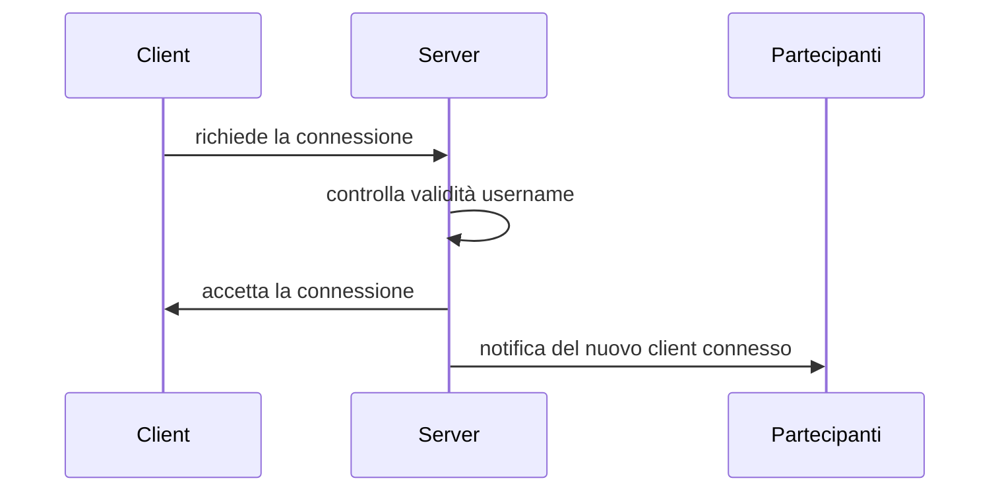
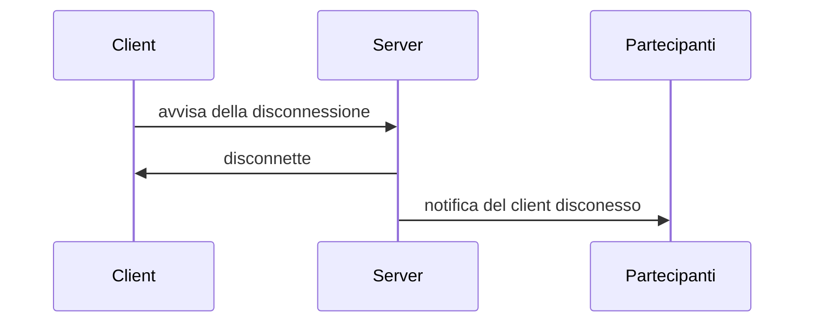
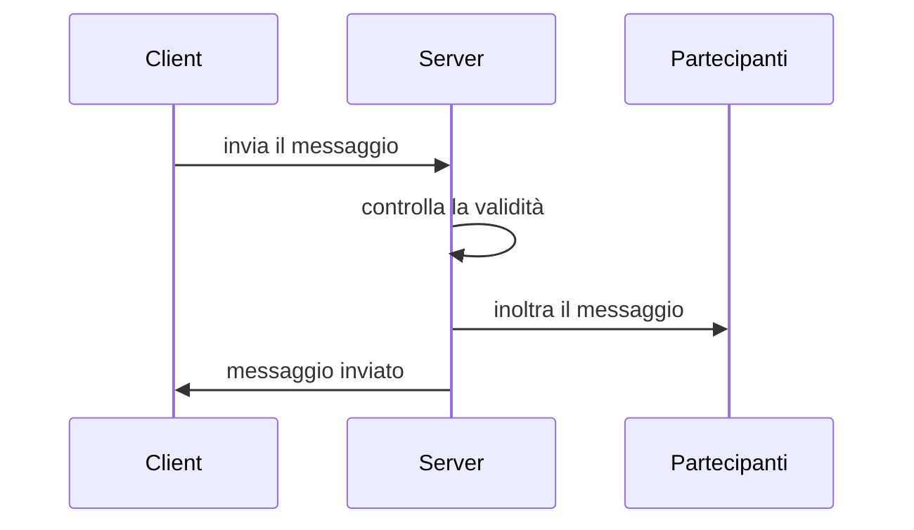
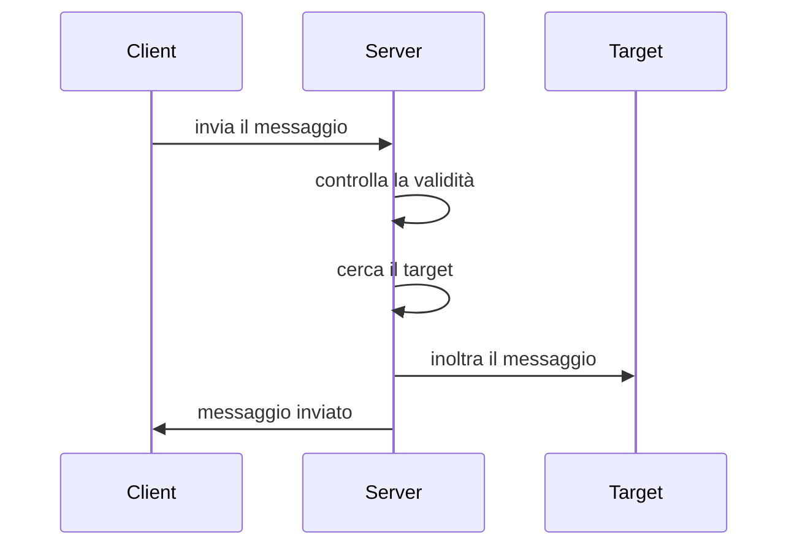
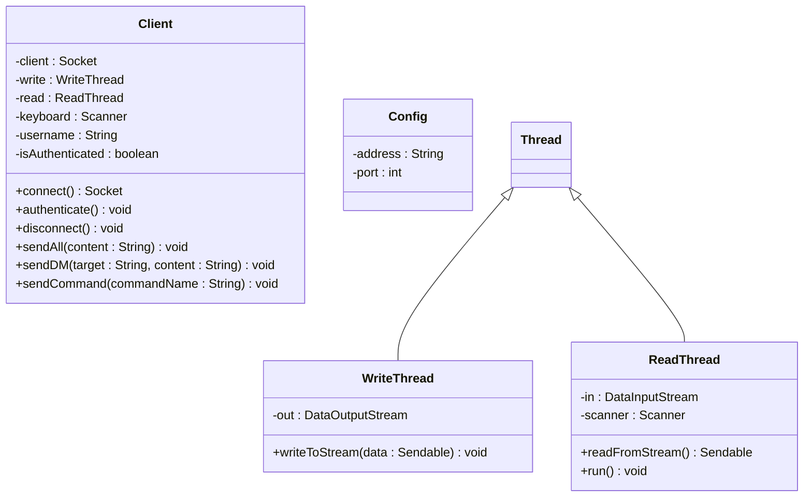
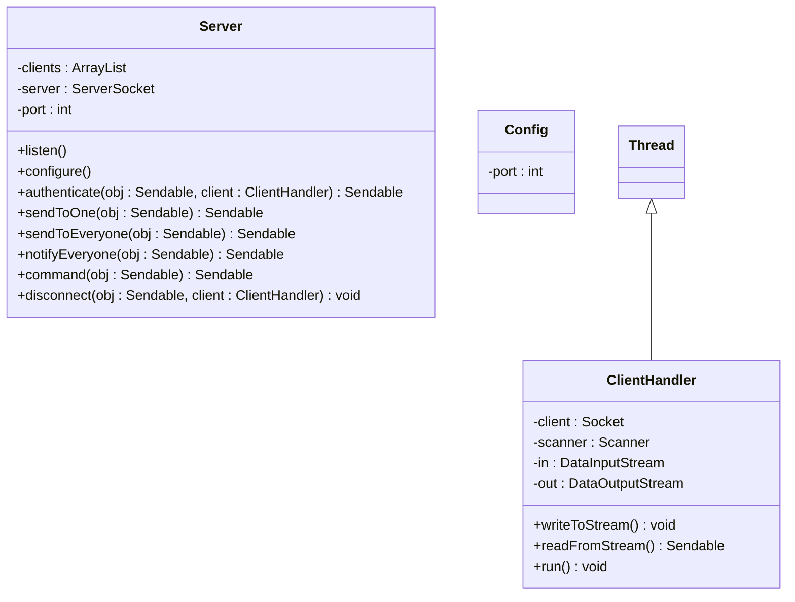
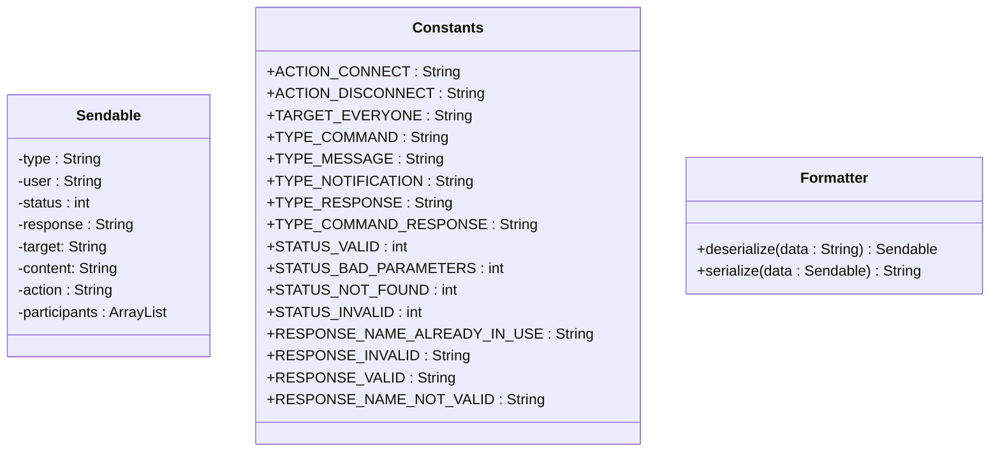

# Java Chat | Leonardo Di Carlo & Niccolò Batistini | 5C-IA
## Indice
  - [Descrizione](#descrizione)
  - [Tecnologie Utilizzate](#tecnologie-utilizzate)
  - [Architettura Messaggi](#architettura-messaggi)
      - [Tabella dei messagi](#tabella-dei-messagi)
      - [Tabella dei comandi](#tabella-dei-comandi)
    - [Client](#client)
      - [Notifica di connessione](#notifica-di-connessione)
      - [Notifica di disconnessione](#notifica-di-disconnessione)
      - [Messaggio generico pubblico](#messaggio-generico-pubblico)
      - [Messaggio generico privato](#messaggio-generico-privato)
      - [Comando della lista](#comando-della-lista)
    - [Server](#server)
      - [Tabella Status](#tabella-status)
      - [Risposta alle notifiche](#risposta-alle-notifiche)
    - [Risposta ai messaggi](#risposta-ai-messaggi)
    - [Risposta ai comandi](#risposta-ai-comandi)
  - [File di configurazione](#file-di-configurazione)
    - [Client](#client-1)
    - [Server](#server-1)
  - [Diagrammi di sequenza](#diagrammi-di-sequenza)
    - [Diagramma della connessione](#diagramma-della-connessione)
    - [Diagramma della disconnessione](#diagramma-della-disconnessione)
    - [Diagramma del messaggio pubblico](#diagramma-del-messaggio-pubblico)
    - [Diagramma del messaggio privato](#diagramma-del-messaggio-privato)
  - [Diagrammi delle classi](#diagrammi-delle-classi)
    - [Client](#client-2)
    - [Server](#server-2)
    - [Classi comuni](#classi-comuni)
  - [Licenza](#licenza)

## Descrizione
Questo progetto consiste nella creazione di una chatroom che implementa i [Socket](https://it.wikipedia.org/wiki/Socket_(reti)) (livello trasporto della pila ISO/OSI) utilizzando il protocollo TCP. Le componenti principali sono due; Client e Server che comunicano in modalità [full duplex](https://it.wikipedia.org/wiki/Duplex#Full-Duplex). I client possono scambiarsi messaggi di testo in [broadcast](https://it.wikipedia.org/wiki/Broadcasting_(informatica)) oppure [unicast](https://it.wikipedia.org/wiki/Unicast).

## Tecnologie Utilizzate
- Java 1.7 (Maven)
- JSON
- Visual Studio Code

Java è il linguaggio di programmazione utilizzato per lo sviluppo di questo progetto, per facilitare la gestione dello stesso è stato incluso anche [Maven](https://maven.apache.org/), ovvero uno strumento di gestione dei progetti Java.

I dati vengono serializzati e deserializzati in JSON utilizzando la libreria [Jackson](https://github.com/FasterXML/jackson) che permette di parsare JSON per poi istanziare oggetti automaticamente. Questa scelta deriva dal fatto che ultimamente JSON è diventato lo standard per la serializzazione di dati ed è più leggero rispetto all'XML, inoltre essendo popolare ha una grande disponibilità di strumenti.

Come ambiente di sviluppo è consigliato usare [Visual Studio Code](https://code.visualstudio.com/) con le [estensioni](https://marketplace.visualstudio.com/items?itemName=vscjava.vscode-java-pack) per lo sviluppo di Java. Questo progetto include la cartella **.vscode** per installare le estensioni consigliate.

## Architettura Messaggi
I messaggi saranno serializzati interamente in JSON.

La fine del messaggio sarà delimitata dal carattere speciale `\0`

I comandi hanno come prefisso il carattere `/`
<br>
Esempio: `/list`

I messaggi vengono scambiati attraverso l'oggetto `Sendable`, esso contiene molti campi. Saranno elencati solo quelli necessari in base al tipo di messaggio scambiato.

#### Tabella dei messagi
| Tipo | Utilizzo  |
|:-:|---|
| Message  | Messaggi generici pubblici e privati  |
| Notification | Notifiche di connessione e disconnessione dei Client |
| Command | Messaggi contenenti comandi gestiti dal server |

#### Tabella dei comandi
| Nome | Azione  |
|:-:|---|
| List  | Visualizza la [lista](#comando-della-lista) di tutti gli utenti connessi  |
| Disconnect  | Disconnette dalla chat |

### Client
Questa sezione definisce tutti gli oggetti che saranno trasmessi dal Client verso il Server

#### Notifica di connessione
Questa notifica verrà inviata dal Client al momento della connessione
```json
{
 "type":"notification",
 "user": "Foo",
 "action": "connect"
}
```
#### Notifica di disconnessione
Questa notifica verrà inviata dal Client al momento della disconnessione
```json
{
 "type":"notification",
 "user": "Foo",
 "action": "disconnect"
}
```

#### Messaggio generico pubblico
In questo caso il client con nome "Foo" sta inviando un messaggio pubblico visibile da tutti
```json
{
 "type":"message",
 "user": "Foo",
 "target": "*",
 "content": "This is an example message"
}
```
#### Messaggio generico privato
In questo caso il client con nome "Foo" sta inviando un messaggio privato che solo "Bar" riceverà
```json
{
 "type":"message",
 "user": "Foo",
 "target": "Bar",
 "content": "This is an example of a private message"
}
```
#### Comando della lista
In questo caso il client con nome "Foo" sta richiedendo la lista di partecipanti al Server
```json
{
 "type":"command",
 "user": "Foo",
 "content": "list"
}
```

### Server
Questa sezione definisce tutti gli oggetti che saranno trasmessi dal Server verso il Client

#### Tabella Status
| Status | Significato  |
|:-:|---|
| 200  | Richiesta valida e processata correttamente  |
| 403 | Richiesta valida con parametri non consentiti |
| 404 | Richiesta valida con destinatario inesistente |
| 422 | Richiesta non valida |

#### Risposta alle notifiche
In questo caso il Server ha accettato la connessione del Client
```json
{
 "status": 200,
 "response": "OK"
}
```
In questo caso il Server ha rifiutato la connessione del Client comunicando il motivo; il nome inserito dall'utente è gia stato utilizzato
```json
{
 "status": 403,
 "response": "This name is already in use, try changing it"
}
```
In questo caso il Server ha rifiutato la connessione del Client comunicando il motivo; 
il formato della richiesta è errato
```json
{
 "status": 422,
 "response": "Could not parse request object"
}
```

### Risposta ai messaggi
In questo caso il Server ha ricevuto il messaggio dal Client e l'ha inoltrato al target
```json
{
 "status": 200,
 "response": "OK"
}
```
In questo caso il Server ha ricevuto il messaggio dal Client ma non è riuscito ad inoltrarlo ai partecipanti della chat.
Questa condizione potrebbe verificarsi quando solo un client è connesso oppure quando il target non esiste
```json
{
 "status": 404,
 "response": "Target not found, the specified target may not exist or you're the only client connected"
}
```

### Risposta ai comandi
In questo caso il Server ha ricevuto il comando [list](#comando-della-lista) dal Client ed ha restituito la lista dei partecipanti
```json
{
 "status": 200,
 "response": "OK",
 "participants": ["Foo", "Bar", "Baz"]
}
```
In questo caso il Server ha ricevuto un comando dal Client ma non è riuscito ad interpretarlo
```json
{
 "status": 403,
 "response": "Command not found"
}
```

## File di configurazione
### Client
Il Client cercherà il file di configurazione `client-config.json` nella cartella root dell'eseguibile. La struttura deve essere la seguente:
```json
{
    "address": "127.0.0.1", // l'indirizzo del server al quale connettersi (default: 127.0.0.1)
    "port": "8080" // la porta del server (default: 8080)
}
```
### Server
Il Server cercherà il file di configurazione `server-config.json` nella cartella root dell'eseguibile. La struttura deve essere la seguente:
```json
{
    "port": "8080" // la porta su cui ascoltare connessioni (default: 8080)
}
```
in alternativa è possibile passare la porta come argomento specificando il flag `-p`
<br>
Esempio: `java -jar server.jar -p 8000`

## Diagrammi di sequenza

### Diagramma della connessione

---
### Diagramma della disconnessione

---
### Diagramma del messaggio pubblico

---
### Diagramma del messaggio privato


## Diagrammi delle classi

### Client

### Server

### Classi comuni

## Licenza
Questo progetto è sotto licenza GNU General Public License v3 (GPL), consultabile a questo [link](https://www.gnu.org/licenses/gpl-3.0.en.html)
